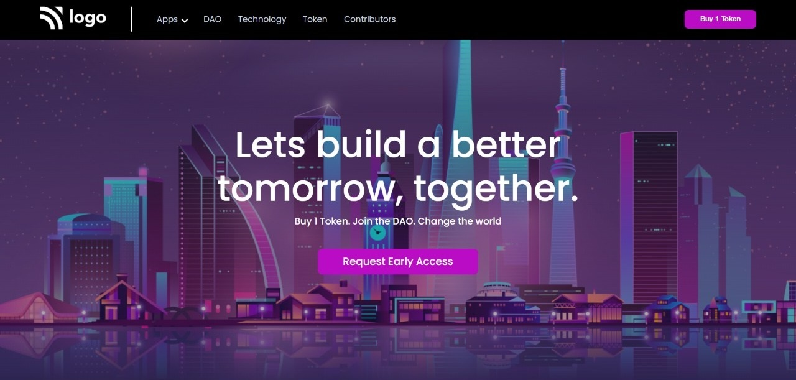

# Assignment-5 
## (Crypto Landing page) 

> In this project, I have used HTML (the Hypertext Markup Language) and CSS (Cascading Style Sheets), which are two of the core technologies for building Web pages. It is a static and non-responsive page.

### As a result of this project, I learn the following:
[LIVE-LINK](https://digitalmarketinghomepage.netlify.app/)

- [x] learned about Font Awesome for dropdown arrow
- [x] Learned about how to use linear-gradient over background image
- [x] design perfect navbar with logo and button
- [x] learned some extra properties about button design

#### The duration of the project:2 hour